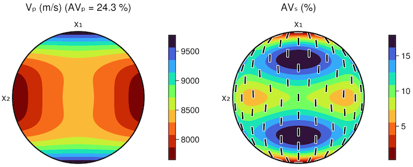
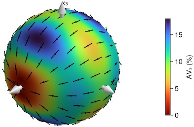

# CIJ.jl

[](https://github.com/anowacki/CIJ.jl/actions)
[](https://codecov.io/gh/anowacki/CIJ.jl)

## What is CIJ.jl?
A [Julia](http://julialang.org) package for dealing with linear elastic
constants, with particular applicability to geophysics problems.


## How to install
Although not registered as an official package, CIJ.jl can be added to your
Julia install like so:

```julia
julia> ] # Type ']' to enter pkg mode

(v1.6) pkg> add https://github.com/anowacki/CIJ.jl
```

You then need only do

```julia
julia> import CIJ
```

and if that works, you're ready to go.


## How to use
CIJ.jl, to make your life as easy as possible, does not insist on your using
a special type for elastic constants, but relies on them being `AbstractArray`s
of an elastic tensor's Voigt matrix.
The Voigt matrix is a 6 &times; 6 array representing the full
3 &times; 3 &times; 3 &times; 3 &times; tensor, subject to symmetries present
for linear elasticity.

Throughout CIJ.jl, we make no assumptions about the *units* of a matrix `C`,
but when it does matter (for instance, calculating phase velocities with
`phase_vels()`), then it is assumed you are dealing with *density-normalised*
constants (i.e., the units are m<sup>2</sup>&nbsp;s<sup>-2</sup>), sometimes called
*A<sub>ij</sub>* instead.  (This is the same as Pa/(kg&nbsp;m<sup>-3</sup>)),

Let's try out a simple example of what we can do:

```julia
julia> C = zeros(6, 6);

julia> CIJ.is_stable(C)
false
```

Here, the `is_stable()` function tells one whether a set of elastic constants
`C` is dynamically possible.  It turns out, a material where all constants are
zero is not.  Olivine, however, should be, so

```julia
julia> C, rho = CIJ.ol(); # Return density-normalised constants, and density, for olivine

julia> is_stable(C)
true
```

is not a surprise.

## `EC` type

Whilst you can deal with plain `Array`s, CIJ exports the `EC` type which is a
wrapper around a `StaticArrays.MMatrix`.

Calculations using this type are quicker.  For instance, finding the compliance
matrix *S* from the stiffness matrix *C* is found by matrix inversion, and this
is about twice as fast when using `EC`s rather than plain `Array`s.

`EC`s are mutable and can be treated just like any other 6 &times; 6 matrix,
including accessing and setting elements like `C[i,j]`.

Construct an `EC` object by calling the `EC()` constructor:

```julia
julia> EC([10i+j for i in 1:6, j in 1:6])
6×6 EC{Float64}:
 11.0  12.0  13.0  14.0  15.0  16.0
 12.0  22.0  23.0  24.0  25.0  26.0
 13.0  23.0  33.0  34.0  35.0  36.0
 14.0  24.0  34.0  44.0  45.0  46.0
 15.0  25.0  35.0  45.0  55.0  56.0
 16.0  26.0  36.0  46.0  56.0  66.0
```

Note that `EC`s are enforced to be symmetric, and will copy the upper half
of the input matrix into the bottom half.  Subsequent modification of any
element will be reflected in both upper and lower halves automatically,
so `EC`s cannot be non-symmetric.

To specify the type of the elements `T`, use the parametric constructor,
`EC{T}()`.

### Calculating phase velocities
One of the common uses for the package is to compute the *phase velocities* in
a given direction through some elastic constants.  This is done using the
`phase_vels()` function, which returns a `NamedTuple`, like so:

```julia
julia> C, rho = CIJ.ol();

julia> az, inc = 20, 45; # Directions

julia> vp, vs1, vs2, pol, avs = CIJ.phase_vels(C, az, inc)
(vp = 8590.639816324323, vs1 = 5422.968116295959, vs2 = 4602.70348828534, pol = -20.682503753509465, avs = 16.363285381017125)
```

`vp`, `vs1` and `vs2` and so on, are velocities in m&nbsp;s<sup>-1</sup>,
assuming `C` is in m<sup>2</sup>&nbsp;s<sup>-2</sup>,
`pol` is the orientation of the fast shear wave in degrees, and `avs` is the
percentage shear wave anisotropy along this direction.

### Converting to Voigt notation
If you have an 81-component tensor `c`, how do you get the Voigt matrix `C`?

```julia
C = CIJ.cij(c)
```

And the other way?

```julia
c = CIJ.cijkl(C)
```

## Plotting
If you are using Julia v1.9 or later, and you have also loaded a
backend from the [Makie.jl](https://docs.makie.org/stable/) ecosystem (e.g.,
by doing `import GLMakie`, `import CairoMakie`, etc.), then you
can create plots of phase velocity surfaces by calling one of the
following functions:

- `CIJ.plot_hemisphere` for a set of upper-hemisphere phase velocity
  surfaces;
- `CIJ.plot_hemisphere!` for a single surface into an existing `Makie.PolarAxis`;
- `CIJ.plot_sphere` for a 3D view of the phase velocity surface; and
- `CIJ.plot_sphere!` for a 3D view into an existing `Makie.Axis3`.

For example:

```julia
julia> import GLMakie

julia> CIJ.plot_hemisphere(CIJ.ol()[1])
```



```julia
julia> CIJ.plot_sphere(CIJ.ol()[1], :avs)
```



## Getting help
Functions are documented, so at the REPL type `?` to get a `help?>` prompt,
and type the name of the function:

```julia
help?> CIJ.phase_vels

  phase_vels(C, az, inc) -> vp, vs1, vs2, pol, avs
  
  Calculate the phase velocities for the 6x6 elasticity matrix C
  along the direction (az, inc), in degrees, and return P-wave
  velocity vp, the fast and slow shear wave velocities, vs1 and
  vs2, the polarisation of the fast shear wave pol, and the shear
  wave velocity anisotropy, avs. Velocities are in m/s if the
  tensor C is in m^2/s^2 (i.e., is a density-normalised tensor,
  sometimes called A).
  
  az is the azimuth in degrees measured from the x1 towards to
  -x2 axis.
  
  inc is the inclination in degrees from the x1-x2 plane towards
  the x3 axis.
```

## Other software

* If you use MATLAB, then you should use [MSAT](https://github.com/andreww/MSAT/).
* If you use Fortran, then you should investigate the module
  `anisotropy_ajn` which is in the
  [seismo-fortran](https://github.com/anowacki/seismo-fortran) repo.


## Why the name?
Linear elastic constants are a fourth-rank tensor, relating the stress
_&sigma;_ in a material to the strain _&epsilon;_ with the relationship

*&sigma;<sub>ij</sub> = c<sub>ijkl</sub> &epsilon;<sub>kl</sub>*,

where _i_, _j_, _k_ and _l_ are indices taking values 1 to 3 and
representing the three cartesian directions in space.  This leads to there
being 3 &times; 3&times; 3 &times; 3 = 81 numbers in the tensor *c*, which
is somewhat unwieldy.

However, certain symmetries mean one can reduce this to 21, and represent
the 4-tensor with a symmetric 2-tensor or matrix instead; the so-called 'Voigt
notation'.  Typically, the lowercase 4-tensor *c<sub>ijkl</sub>* becomes the
uppercase matrix *C<sub>ij</sub>*, and thus the package is born.


## Acknowledgments
Credit goes to [James Wookey](http://www1.gly.bris.ac.uk/~wookey) and
[Mike Kendall](http://www1.gly.bris.ac.uk/~jmk/) for the original set of Fortran
routines on which the code is based, and which lives on in the
[seismo-fortran](https://github.com/anowacki/seismo-fortran) repo.

